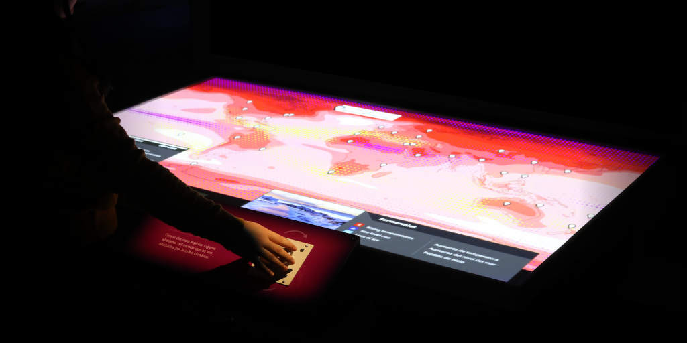

## What is FAST?
<ins>F</ins>lexible, <ins>A</ins>ccessible <ins>S</ins>trategies for <ins>T</ins>imely Digital Exhibit Design

Museums play a critical role in engaging their communities around urgent 
issues that emerge in the public sphere. However, typical exhibit development 
timelines can stretch for years, and "what's new" can change swiftly before 
an exhibition is even launched. What if museums could stay agile and dynamic, 
changing out content as community needs shift, science progresses, and the 
world changes? What if timely exhibit offerings could be not just efficiently 
produced, but accessible and welcoming to all visitors? This vision of 
efficiency and accessibility is at the center of FAST.

For more of an introduction and explanation of the FAST project, please see: [FAST Booklet](https://mos.widen.net/s/gkftj8tgl8/fast_booklet)

### Notice

Copyright (C) 2024 Museum of Science, Boston
<https://www.mos.org/>

This software was developed through a grant to the Museum of Science, 
Boston from the Institute of Museum and Library Services under Award 
#MG-249646-OMS-21. For more information about this grant, see 
<https://www.imls.gov/grants/awarded/mg-249646-oms-21>.

## What is the FAST SDK?
The FAST SDK consists of three parts:
1. A Unity Package that addresses the following software functionality when developing exhibits:
    * Standardized file structure
    * Content skins
    * Multiple language support
    * Reading and writing an XML settings file
    * Verifying configuration and connections during startup with a loading sequence
    * Loading images, audio, and videos from the file system
    * Communicating with serial, UDP, and HTTP connections
    * Projector alignment of 2D and 3D graphics
    * Audio player for narration, sound effects, and multi-channel output
    * Screen management framework, similar to a state machine
    * Marker-based inputs/"tools"
2. A set of 3 exhibit template applications built in Unity. These demonstrate using the SDK and FAST principles:
    * Object Investigation - A digital exhibit experience that allows for exploration of real objects or physical models, identification or classification, and learning about a variety of items.
    * Quiz Show - A digital exhibit experience that allows for multiplayer participation, in-depth exploration of a topic, multiple-choice questions, and true/false questions.
    * Node Exploration - A digital exhibit experience to explore nodes in a network. A node is selected by turning a rotary dial. The content for the selected node is displayed in a panel and animated in a video.
3. A Windows application that tracks ArUco markers with OpenCV and sends the data over UDP.

## How do I access the FAST SDK?
Use the pinned respositories or links below:
* [FAST SDK Unity Package](https://github.com/FAST-Digital-Exhibit-Design/FAST-SDK)
    * [Developer Guide](https://github.com/FAST-Digital-Exhibit-Design/FAST-SDK/wiki)
    * [Coding Reference](https://FAST-Digital-Exhibit-Design.github.io/FAST-SDK-Documentation/)
* [FAST Exhibit Templates](https://github.com/FAST-Digital-Exhibit-Design/FAST-Exhibit-Templates)
    * [FAST Object Investigation](https://github.com/FAST-Digital-Exhibit-Design/FAST-Exhibit-Templates/tree/main/FAST%20Object%20Investigation)
    * [FAST Quiz Show](https://github.com/FAST-Digital-Exhibit-Design/FAST-Exhibit-Templates/tree/main/FAST%20Quiz%20Show)
    * [FAST Node Exploration](https://github.com/FAST-Digital-Exhibit-Design/FAST-Exhibit-Templates/tree/main/FAST%20Node%20Exploration)
* [FAST Computer Vision](https://github.com/FAST-Digital-Exhibit-Design/FAST-Computer-Vision)